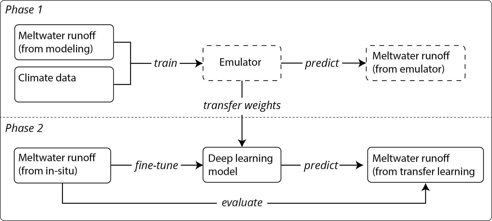

[](https://doi.org/10.5281/zenodo.21649501)

# Modeling Greenland Ice Sheet catchment-scale meltwater runoff using transfer learning

This repository contains the code for the article:
> Maciel-Seidman, M.L., Ryan, J.C., Esenther, S.E., Rennermalm, Å.K., Smith, L.C. and Fettweis, X., **A transfer learning approach for simulation of Greenland Ice Sheet meltwater runoff**. *Journal of Geophysical Research: Machine Learning and Computation* (submitted)

## Summary

In this study we develop deep learning emulators of the regional climate model Modèle Atmosphérique Régional (MAR) version 3.14 to predict catchment-scale meltwater runoff from three catchments on the Greenland Ice Sheet. We then fine-tune these emulators with in-situ observations of meltwater runoff to produce transfer learning models. We find that conducting transfer learning reduces error in meltwater runoff predictions by 89.5%, as compared to our emulators.


*Conceptual overview of modeling approach employed in this study. Dashed boxes indicate intermediate steps. Previous studies have carried out RCM emulation (Phase 1). Our study advances these studies by applying transfer learning (Phase 2) to improve the accuracy of meltwater runoff predictions.*

## Repository structure

```bash
transfer-learning-meltwater-runoff/
├── 0_pre-process
├── 1_training-experiments
├── 2_pre-training_MAR_emulators	
├── 3_fine-tuning_TL_models
├── 4_evaluation_and_figures
├── AK4_catchment_variables
├── Minturn_catchment_variables
├── Rio_Behar_catchment_variables
├── catchment in-situ data
├── catchment_TL_models
├── catchment_delineations
├── catchment_training_experiment_logs
├── evaluation_output
├── LICENSE
└── README.md
```

## Data availability

The data required to reproduce the findings of this study for every step beyond 0_pre-process are included in this repository. The MAR version 3.14 NetCDF files needed for the pre-processing step can be downloaded from the MAR FTP server (ftp://ftp.climato.be/fettweis/MARv3.14/Greenland/ERA5-10km-daily/).

## Acknowledgements

This research was supported by NASA award #80NSSC25K7364 managed by Dr. Thorsten Markus. We thank Matthew Cooper for providing the Rio Behar catchment delineation and Xavier Fettweis for making the MARv3.14 outputs available.
